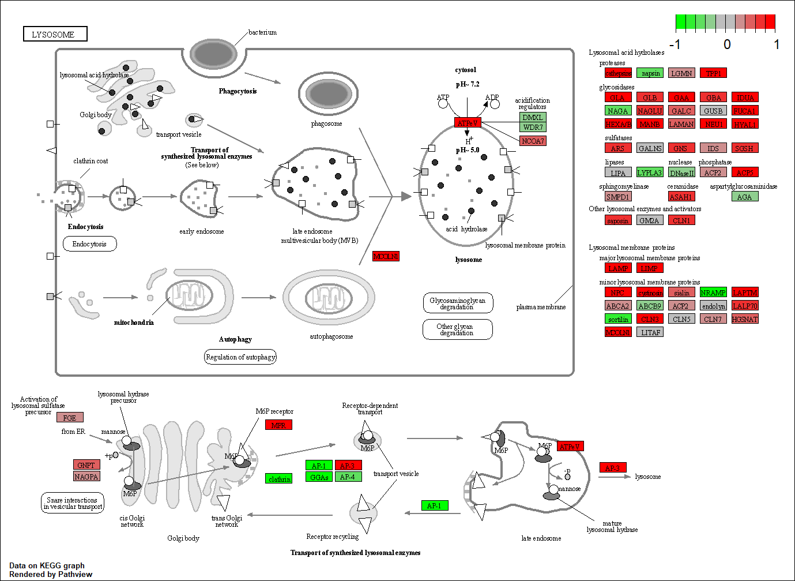

```{r, include=FALSE}
library(DESeq2)
```

```{r Import metadata files}
metaFile <- "GSE37704_metadata.csv"
countFile <- "GSE37704_featurecounts.csv"

# Import metadata and take a peak
colData = read.csv(metaFile, row.names=1)
head(colData)
```

```{r Import count files}
# Import countdata
countData = read.csv(countFile, row.names=1)
head(countData)
```

```{r}
# Note we need to remove the odd first $length col
countData <- as.matrix(countData[,-1])
head(countData)
```

Get rid of rows that have 0s across ALL samples.
```{r}
countData = countData[-which(rowSums(countData) ==0),]
head(countData)
```

## PCA
Try running a PCA for quality control - you want to see your samples of the same group clustering together. This data turns out to be of decent quality.
```{r}
pca <- prcomp(t(countData), scale=TRUE)
plot(pca$x[,1], pca$x[,2], xlab="PC1", ylab="PC2", col=as.factor(colData$condition))

summary(pca)
```

## DESeq 
Now we can run DESeq!
```{r}
dds = DESeqDataSetFromMatrix(countData=countData,
                             colData=colData,
                             design=~condition)
dds = DESeq(dds)

dds
```

```{r}
res = results(dds)
summary(res)
```

## Make a volcano plot
```{r}
plot( res$log2FoldChange, -log(res$padj) )
```

Make the volcano plot prettier! 
```{r}
# Make a color vector for all genes
mycols <- rep("gray", nrow(res) )

# Color red the genes with absolute fold change above 2
mycols[ abs(res$log2FoldChange) > 2 ] <- "red"

# Color blue those with adjusted p-value less than 0.01
#  and absolute fold change more than 2
inds <- (abs(res$log2FoldChange < -2)) & (abs(res$log2FoldChange) > 2 )
mycols[ inds ] <- "blue"

plot( res$log2FoldChange, -log(res$padj), col=mycols, xlab="Log2(FoldChange)", ylab="-Log(P-value)" )
```
We will use EnhancedVolcano later (after generating gene annotations because we only have Ensembl IDs right now).

## Add gene annotation
```{r, include=FALSE}
library("AnnotationDbi")
library("org.Hs.eg.db")
```

Do some ID conversions
```{r}
res$symbol = mapIds(org.Hs.eg.db,
                    keys=row.names(res), 
                    keytype="ENSEMBL",
                    column='SYMBOL',
                    multiVals="first")

res$entrez = mapIds(org.Hs.eg.db,
                    keys=row.names(res),
                    keytype="ENSEMBL",
                    column="ENTREZID",
                    multiVals="first")

res$name =   mapIds(org.Hs.eg.db,
                    keys=row.names(res),
                    keytype='ENSEMBL',
                    column='GENENAME',
                    multiVals="first")

head(res)
```
Now use EnhancedVolcano!
```{r EnhancedVolcano plot, include=FALSE}
library(EnhancedVolcano)
```

```{r}
x <- as.data.frame(res)

EnhancedVolcano(x,
    lab = x$symbol,
    x = 'log2FoldChange',
    y = 'pvalue')
```
Try this in ggplot!
```{r}
x$big <- abs(res$log2FoldChange) > 2

ggplot(x) + aes(log2FoldChange, -log(padj), col = big) + 
  geom_point()
```


Reorder results by adjusted p-value and save them to a CSV file in current project directory
```{r}
res = res[order(res$pvalue),]
write.csv(res, file="deseq_results.csv")
```


## Pathway Analysis
```{r include=FALSE}
library(pathview)
library(gage)
library(gageData)
```

```{r}
data(kegg.sets.hs)
data(sigmet.idx.hs)

kegg.sets.hs = kegg.sets.hs[sigmet.idx.hs]

head(kegg.sets.hs, 3)
```

Make the list of fold changes with according labels (Entrez IDs)
```{r}
foldchanges = res$log2FoldChange
names(foldchanges) = res$entrez
head(foldchanges)
```

Perform GSEA! 
```{r GSEA}
keggres = gage(foldchanges, gsets=kegg.sets.hs)

attributes(keggres)

#Look at what's downregulated under "less"
head(keggres$less)
```

Look at the cell cycle pathway with pathview()
```{r}
pathview(gene.data=foldchanges, pathway.id="hsa04110")
```


```{r}
pathview(gene.data=foldchanges, pathway.id="hsa04110", kegg.native=FALSE)
```

Now we want to look at the top 5 most highly upregulated pathways! 
```{r}
keggrespathways <- rownames(keggres$greater)[1:5]

# Extract the 8 character long IDs part of each string
keggresids = substr(keggrespathways, start=1, stop=8)
keggresids
```

Use pathview(); if you use a list of pathway IDs in this function, you'll get all of the pngs for each pathway back! 
```{r}
pathview(gene.data=foldchanges, pathway.id=keggresids, species="hsa")
```





## Gene Ontology (GO)
```{r}
data(go.sets.hs)
data(go.subs.hs)

gobpsets = go.sets.hs[go.subs.hs$BP]

gobpres = gage(foldchanges, gsets=gobpsets, same.dir=TRUE)

lapply(gobpres, head)
```


## Reactome analysis 
First get list of genes that are significantly up/downregulated with p <0.05.
```{r}
sig_genes <- res[res$padj <= 0.05 & !is.na(res$padj), "symbol"]
print(paste("Total number of significant genes:", length(sig_genes)))
```

Output this list of significant genes as a txt file 
```{r}
write.table(sig_genes, file="significant_genes.txt", row.names=FALSE, col.names=FALSE, quote=FALSE)
```

We then submit this list of genes to the Reactome database online. 

The endosomal/vacuolar pathway had the most significant pvalue (2.01E4). This does not match up with my KEGG results, but this could be because we changed the alpha; we put a list of genes with significance p < 0.1 into KEGG but put a more stringently filtered list of genes (p < 0.05 significance) into Reactome. 
